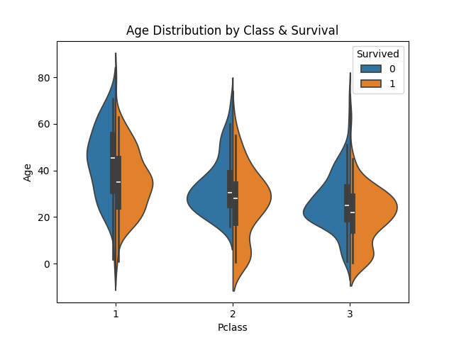

# Titanic Data Visualization Project

## 📂 Dataset
This project uses the famous [Titanic Dataset](https://www.kaggle.com/competitions/titanic).  
File used: `train.csv`  

The dataset contains passenger details such as age, sex, class, fare, and survival status.

---


## 📊 Visualizations

### 1. Survival Rate by Sex
---


### 2. Age Distribution by Class & Survival




### 3. Fare Distribution by Class


### 4. KDE Plot of Age


### 5. Fare vs Survival (Swarm Plot)


---

## 📝 Insights
- Females had a **much higher survival rate** than males.  
- Passengers in **1st Class** had higher chances of survival compared to 2nd and 3rd class.  
- **Children and younger passengers** had better survival rates.  
- Higher fares (wealthier passengers) were **linked to survival**.  

---

## ▶️ How to Run
1. Clone this repo:
   ```bash
   git clone https://github.com/Prachigade03/titanic_data_visualization.git
